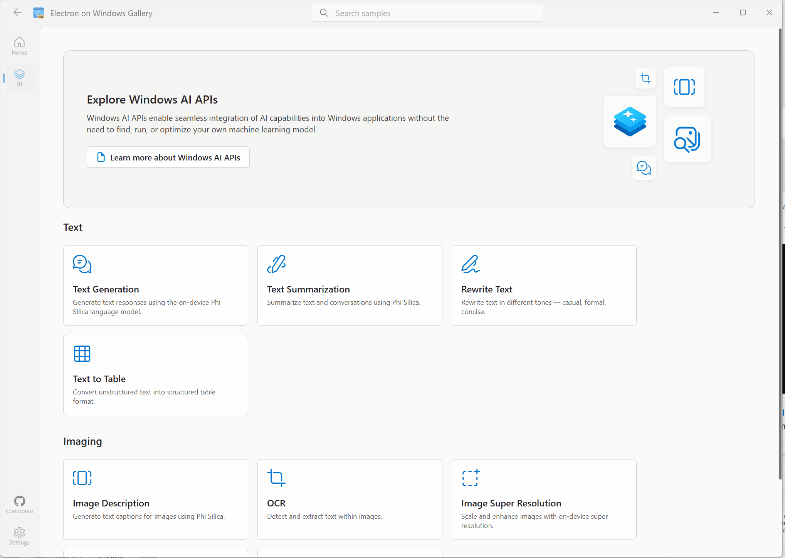
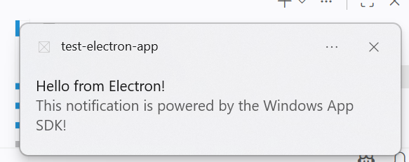
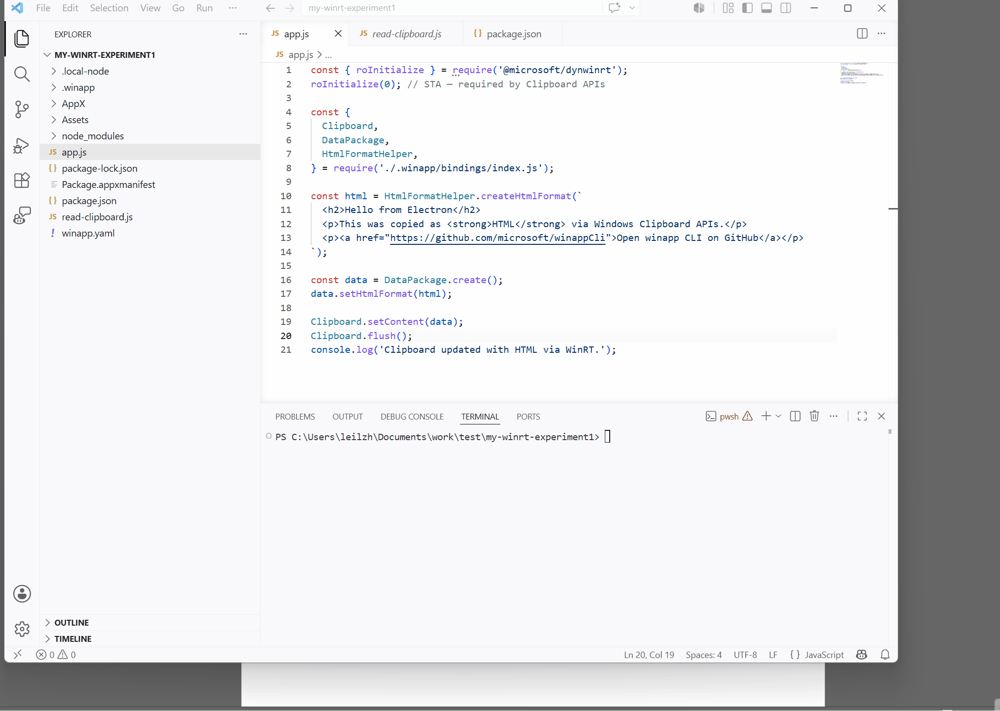

# A new way to bring native Windows APIs to JavaScript — introducing dynamic API projections for Node.js


JavaScript developers commonly use Electron and Node.js to build desktop apps that run on Windows, but using Windows Runtime APIs for features such as on-device AI has traditionally required an app-specific interop layer. Developers had to build a C++ or C# bridge, translate WinRT types and asynchronous behavior into JavaScript, and maintain wrapper code for every API they exposed. This introduced another language and toolchain, along with architecture and Electron compatibility work. Each new API meant more native code to build, test, and maintain.

Today, we're excited to introduce **a dynamic Windows Runtime API (WinRT) projection for Node.js**, now available in public preview. It lets your Electron app, or a plain Node.js process, call supported Windows Runtime APIs directly from JavaScript or TypeScript. Install one npm package to get JavaScript wrappers and TypeScript types for the Windows features you want. You do not need to build an app-specific native addon, configure `node-gyp`, or maintain a C++ wrapper. 🚀

## What makes this projection different

The Windows Runtime already has static language projections for [C++/WinRT](https://github.com/microsoft/cppwinrt), [C#/WinRT](https://github.com/microsoft/cswinrt), [`windows-rs`](https://github.com/microsoft/windows-rs), and [PyWinRT](https://github.com/pywinrt/pywinrt). This new projection adds JavaScript to that list and targets the **Node.js runtime**. Instead of using a hand-authored native addon for each API, it combines code generation with a shared runtime. This removes the need to write per-API C++, configure a `node-gyp` toolchain, or rebuild for each Electron version. Compatible APIs can be projected by rerunning code generation when their metadata becomes available.

- **Generated JavaScript wrappers, not per-class native addons.** Codegen produces `.js` wrappers and `.d.ts` declarations for supported Windows Runtime API patterns.
- **One shared prebuilt runtime.** `@microsoft/dynwinrt`, installed from npm, dispatches all the calls at execution time.
- **Regenerate, don't rebuild.** Rerun codegen when compatible Windows API metadata changes. There are no hand-authored per-API wrappers to wait for.

## What you can build with the projection

By reading Windows metadata (`.winmd`), the projection is not limited to a fixed catalog of APIs. It enables Node.js apps to use a broad range of non-UI WinRT APIs. Here are just a few examples:

- **[On-device AI](https://github.com/microsoft/electron-on-windows-gallery):** text generation, summarization, rewriting, text-to-table, image description, text recognition, image scaling, object extraction and removal, plus [Windows ML model and execution provider catalogs](https://github.com/microsoft/winappCli/blob/main/docs/guides/electron/js-winml.md)
- **App and content APIs:** [notifications](https://github.com/microsoft/winappCli/blob/main/docs/guides/electron/js-notification.md), [file and folder pickers, storage, and image decoding](https://github.com/microsoft/winappCli/blob/main/docs/guides/electron/js-file-picker.md), plus rich clipboard content
- **System and device APIs:** networking, sensors, globalization, and cryptography

This list is not exhaustive. Developers can use the same metadata-driven workflow to project many other compatible Windows Runtime APIs, as well as their own WinRT components.

You can explore the AI scenarios today in [**Electron on Windows Gallery**](https://github.com/microsoft/electron-on-windows-gallery), an open-source Electron app built with these JavaScript projections. Each interactive sample includes the JavaScript source, API documentation, and getting-started guidance.

<p align="center">
  
</p>

## How the pieces fit together

The projection is delivered through three npm packages. You install only `@microsoft/winappcli`; it coordinates the other two and keeps their versions aligned:

- **[`@microsoft/winappcli`](https://www.npmjs.com/package/@microsoft/winappcli)** sets up the manifest and SDK metadata, runs projection generation, and handles debug package identity.
- **[`@microsoft/dynwinrt-codegen`](https://www.npmjs.com/package/@microsoft/dynwinrt-codegen)** reads that `.winmd` metadata and emits JavaScript wrappers with matching TypeScript declarations (`.js` + `.d.ts`).
- **[`@microsoft/dynwinrt`](https://www.npmjs.com/package/@microsoft/dynwinrt)** is the shared, prebuilt x64 and arm64 runtime that dispatches those Windows API calls when your app runs.

Together, they turn Windows metadata into JavaScript APIs your app can import and call. Now let's put that flow to work.

## Build two Windows experiences in Electron

We'll build both examples entirely in JavaScript:

- **Native notifications** with `AppNotificationBuilder` / `AppNotificationManager`
- **Phi Silica on-device AI** with `LanguageModel` / `TextSummarizer` (Copilot+ PCs)

### Project setup

In your Electron app, install the CLI and initialize:

```bash
npm install --save-dev @microsoft/winappcli
npx winapp init . --use-defaults --add-js-bindings
```

The WinApp CLI sets up the manifest and SDKs, adds `@microsoft/dynwinrt` + `@microsoft/dynwinrt-codegen` to your `package.json`, and generates JavaScript wrappers and TypeScript types for the supported Windows App SDK APIs in `.winapp/bindings/`. It also writes a `winapp.jsBindings` config block where you can extend the generated surface with additional namespaces or `.winmd` files, including metadata from your own WinRT components.

Setup also adds `#winapp/bindings` and `#winapp/bindings/*` to the `package.json#imports` map. The aliases select the generated CommonJS, ES module, and TypeScript declaration entry points, so imports stay the same no matter which source file uses them. See the [file picker guide](https://github.com/microsoft/winappCli/blob/main/docs/guides/electron/js-file-picker.md) for a detailed configuration example.

Both walkthroughs below (`AppNotificationManager` and Phi Silica) use APIs that require package identity. To unblock those APIs during development, grant your Electron dev build a temporary identity:

```bash
npx winapp node add-electron-debug-identity
```

Rerun `npx winapp node add-electron-debug-identity` whenever the manifest, exe path, or identity fields change. For APIs that don't require package identity, you can start Electron normally with `npm start` and skip this step. See the [debug identity guide](https://github.com/microsoft/winappCli/blob/main/docs/guides/electron/setup.md#step-5-understanding-debug-identity) for the full model, including which API categories require identity.

### Show a rich Windows notification

Electron can already show a basic notification, but Windows App SDK notifications let you use richer Windows-native toast features like progress bars, actions, inputs, and scenarios. Here's a progress notification from the Electron main process:

```js
const {
  AppNotificationBuilder,
  AppNotificationManager,
  AppNotificationProgressBar,
} = require('#winapp/bindings');

const progress = AppNotificationProgressBar
  .create()
  .setTitle('Processing with Windows AI')
  .setStatus('Running locally')
  .setValue(0.65)
  .setValueStringOverride('65%');

AppNotificationManager.default_.show(
  AppNotificationBuilder
    .create()
    .addText('Windows AI task running')
    .addText('This notification uses a native Windows progress bar.')
    .addProgressBar(progress)
    .buildNotification()
);
```
Run the app, and Windows fires the same native toast you'd get from a C#/C++ app, including the progress bar:



See the [Show a notification from JavaScript](https://github.com/microsoft/winappCli/blob/main/docs/guides/electron/js-notification.md) guide for a full walkthrough.

### Run Phi Silica on-device AI

You can also add on-device AI to Electron directly from your app's JavaScript, using **Phi Silica**, a local language model that ships with Windows. **This requires a [Copilot+ PC](https://learn.microsoft.com/en-us/windows/ai/npu-devices/).**

```js
const {
  AIFeatureReadyState, LanguageModel, TextSummarizer,
} = require('#winapp/bindings');

async function summarize() {
  const readyState = LanguageModel.getReadyState();
  if (readyState !== AIFeatureReadyState.Ready &&
      readyState !== AIFeatureReadyState.NotReady) {
    console.log('Phi Silica is not available on this device.');
    return;
  }
  if (readyState === AIFeatureReadyState.NotReady) {
    await LanguageModel.ensureReadyAsync();
  }

  const model = await LanguageModel.createAsync();
  try {
    const op = TextSummarizer
      .createInstance(model)
      .summarizeParagraphAsync('Some long paragraph...');

    // Stream partial output as the model generates it
    op.progress((partial) => {
      process.stdout.write(partial);
    });

    const result = await op;
    console.log('\nDone:', result.text);
  } finally {
    model.close();
  }
}

summarize().catch(console.error);
```

Before running, add this restricted capability inside the existing `<Capabilities>` element in `Package.appxmanifest`:

```xml
<rescap:Capability Name="systemAIModels" />
```

Then refresh debug identity:

```bash
npx winapp node add-electron-debug-identity
```

Running the snippet above in an Electron main process, the summary streams into the terminal chunk by chunk, followed by the final `Done:` line:


See the [Call Phi Silica from JavaScript](https://github.com/microsoft/winappCli/blob/main/docs/guides/electron/js-phi-silica.md) guide for a full walkthrough.

## Extending to Windows SDK and beyond

By default the WinApp CLI feeds codegen the supported Windows App SDK API surface (UI-only packages like `Microsoft.WindowsAppSDK.WinUI` and `Microsoft.Web.WebView2` are excluded). To pull in Windows SDK APIs as well, list the entry-point classes you want in `package.json`. For example, add the Windows Clipboard API:

```jsonc
{
  "winapp": {
    "jsBindings": {
      "additionalWinmds": [
        {
          "namespace": "Windows.ApplicationModel.DataTransfer",
          "classes": ["Clipboard", "HtmlFormatHelper"]
        }
      ]
    }
  }
}
```

Then regenerate bindings:

```bash
npx winapp node generate-bindings
```

The codegen transitively pulls in dependent types, so you only list the entry-point classes.

Now your Electron main process can write richer Windows clipboard content. For example, HTML that pastes as formatted text in Word, Outlook, or Teams:

```js
const {
  Clipboard,
  DataPackage,
  HtmlFormatHelper,
} = require('#winapp/bindings');

const html = HtmlFormatHelper.createHtmlFormat(`
  <h2>Hello from Electron</h2>
  <p>This was copied as <strong>HTML</strong> via Windows Clipboard APIs.</p>
  <p><a href="https://github.com/microsoft/winappCli">Open WinApp CLI on GitHub</a></p>
`);

const data = DataPackage.create();
data.setHtmlFormat(html);

Clipboard.setContent(data);
Clipboard.flush();
```

`HtmlFormatHelper.createHtmlFormat` wraps your markup with the CF_HTML header Windows expects, so any HTML-aware target renders it as rich text.

<p align="center">
  
</p>

For third-party WinRT components, or to include a package the WinApp CLI doesn't ship by default, add an entry with a `winmdPath` to `winapp.jsBindings.additionalWinmds`:

```json
{
  "winapp": {
    "jsBindings": {
      "additionalWinmds": [
        {
          "winmdPath": "path/to/Foo.winmd",
          "namespace": "Foo.Bar",
          "classes": ["Baz"]
        }
      ]
    }
  }
}
```

This generates JavaScript wrappers and TypeScript types. At runtime, you must also deploy the component binaries and configure any activation the component requires, often in your app's `Package.appxmanifest`.

## Use the projection with plain Node.js

Not using Electron? The JavaScript projections also work from a plain Node.js process. If you just want to try a Windows API on your own machine without packaging an MSIX, set up a project and point it at your existing `node.exe`:

```powershell
mkdir my-winrt-experiment; cd my-winrt-experiment
npm init -y
npm install --save-dev @microsoft/winappcli
npx winapp init . --use-defaults --add-js-bindings

# winapp run needs an .exe inside the project. Alias .local-node to your Node install.
New-Item -ItemType Junction -Path .\.local-node -Target (Split-Path (Get-Command node).Source)

# --with-alias preserves stdout/stderr, so add an execution alias once.
npx winapp manifest add-alias --name mynode.exe
```

We'll call Phi Silica again from Node.js, so add the same `systemAIModels` capability to `Package.appxmanifest`. Then in `app.js`, use `TextRewriter` to polish a sentence:

```js
const { roInitialize } = require('@microsoft/dynwinrt');
roInitialize(1); // MTA

const {
  AIFeatureReadyState,
  LanguageModel,
  TextRewriter,
  TextRewriteTone,
} = require('#winapp/bindings');

async function main() {
  const readyState = LanguageModel.getReadyState();
  if (readyState !== AIFeatureReadyState.Ready &&
      readyState !== AIFeatureReadyState.NotReady) {
    console.log('Phi Silica is not available on this device.');
    return;
  }
  if (readyState === AIFeatureReadyState.NotReady) {
    await LanguageModel.ensureReadyAsync();
  }

  const model = await LanguageModel.createAsync();
  try {
    const rewriter = TextRewriter.createInstance(model);
    const result = await rewriter.rewriteAsync(
      'WinApp CLI makes it easier to use Windows APIs from JavaScript.',
      TextRewriteTone.Formal
    );
    console.log(result.text);
  } finally {
    model.close();
  }
}

main().catch((error) => {
  console.error(error);
  process.exitCode = 1;
});
```

Run the script under a registered package identity in one shot:

```powershell
npx winapp run . --exe .local-node\node.exe --with-alias --args "app.js" --unregister-on-exit
```

The rewritten text prints straight to your terminal. Under the hood, `winapp run` registers the loose-layout package, launches `.local-node\node.exe app.js` with package identity and the Windows App SDK runtime graph, and unregisters on exit (`--unregister-on-exit`). `--with-alias` uses the execution alias added above so stdout streams back to the launching terminal (without it, packaged apps run detached).

For an iteration-friendly variant using a persistent execution alias (`mynode.exe app.js` from any terminal) and packaging notes, see the full [Plain Node.js dev-mode guide](https://github.com/microsoft/dynwinrt/blob/main/docs/guides/node/dev-mode.md).

## How the projection works

`dynwinrt-codegen` runs during `winapp init` / `restore` / `generate-bindings` and turns `.winmd` metadata into JavaScript wrappers with TypeScript types. No native code is generated per class. At execution time, `@microsoft/dynwinrt` invokes the underlying COM vtables directly and adapts WinRT conventions to JavaScript. For example, it converts strings and errors, makes asynchronous operations awaitable with cancellation support and progress when the API provides it, and projects generic collections, structs, enums, and event delegates.

The projection primarily targets data-style Windows Runtime APIs such as AI, storage, notifications, networking, and similar system capabilities. The same runtime can also host WinUI 3 directly from a plain Node.js process for controlled native UI scenarios; see the [`node-winui` sample](https://github.com/microsoft/winappCli/tree/main/samples/node-winui). WebView2 is not part of the generated projection surface.

For the full design, see [`dynwinrt/design.md`](https://github.com/microsoft/dynwinrt/blob/main/design.md).

## Final thoughts and feedback

This is a public preview, and there's a lot we still want to sharpen. If a Windows API doesn't shape well in JS, a TypeScript type feels off, or a scenario you care about isn't covered yet, please file feedback. We're actively deciding what to invest in next.

The WinApp CLI and the underlying projection live in **two different repos**. File feedback in whichever fits your issue:

- **CLI setup, configuration, identity, docs, and samples:** [`microsoft/winappCli`](https://github.com/microsoft/winappCli/issues)
- **Runtime, code generator, type mapping, and generated TypeScript declarations:** [`microsoft/dynwinrt`](https://github.com/microsoft/dynwinrt/issues)

### WinApp CLI

- Repo and full command reference: [`microsoft/winappCli`](https://github.com/microsoft/winappCli)
- Install: [`@microsoft/winappcli`](https://www.npmjs.com/package/@microsoft/winappcli) on npm
- Electron getting-started guides: [setup](https://github.com/microsoft/winappCli/blob/main/docs/guides/electron/setup.md) · [file picker](https://github.com/microsoft/winappCli/blob/main/docs/guides/electron/js-file-picker.md) · [notification](https://github.com/microsoft/winappCli/blob/main/docs/guides/electron/js-notification.md) · [Phi Silica](https://github.com/microsoft/winappCli/blob/main/docs/guides/electron/js-phi-silica.md) · [WinML](https://github.com/microsoft/winappCli/blob/main/docs/guides/electron/js-winml.md)
- Debug identity for Electron: [Understanding Debug Identity in the setup guide](https://github.com/microsoft/winappCli/blob/main/docs/guides/electron/setup.md#step-5-understanding-debug-identity)

### dynwinrt (the projection itself)

- Repo, design notes, and benchmarks: [`microsoft/dynwinrt`](https://github.com/microsoft/dynwinrt)

We're excited to see what you build using the Node.js projection, `@microsoft/dynwinrt`, and the WinApp CLI. Happy coding! 🎉
