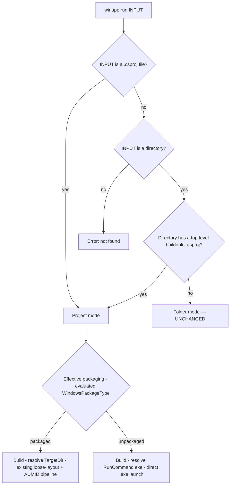

# Spec: `.csproj` (project mode) support for `winapp run`

> **Status:** 🟡 Draft v0.4 — living document, iterate freely
> **Branch:** `winui-devex`
> **Owner:** (you) · **Author of draft:** Copilot
>
> **v0.4 changes (cross-model review):** three independent model reviews (Opus / Gemini / GPT) + local
> experiments corrected §8.3's output-resolution mechanics: `dotnet build --getProperty` **does not
> build** (must add `-t:Build`); use **`RunCommand`** (apphost `.exe`), not `TargetPath` (which is the
> `.dll`); use absolute **`TargetDir`**, not the relative `OutDir`; parse **JSON** for multi-property
> queries; the `--no-build` evaluate path must use `dotnet msbuild -p:…` (not `-c`/`-r`). Runtime install
> must target the **app's** arch, not the CLI's. Min SDK corrected to **8.0.100**. See §11 "Cross-model
> review."
> **v0.3 changes:** corrected the runtime finding — packaged `run` **already installs** the WinAppSDK
> framework packages today; unpackaged now **reuses that same install** (gated on self-contained),
> closing Q4. Dropped the `--packaged`/`--unpackaged` flags in favor of the project's own effective
> config (`-p:WindowsPackageType=…` is the per-run escape hatch), closing that question. Resolved the
> `-p`-vs-flag conflict by mirroring `dotnet` (dedicated flag wins; duplicate `-p` last-wins), verified
> empirically.
> **v0.2 changes:** packaging detection keyed off the *evaluated* `WindowsPackageType` (not manifest
> presence); `--getProperty` output resolution with a minimum-SDK requirement; added `-p/--property`
> MSBuild passthrough; decisions for Q1–Q3, Q5, Q7 and a recommendation for Q6.

---

## 1. Summary

Today `winapp run` accepts a **pre-built folder** and always creates an MSIX package
identity to launch the app. This spec adds a **project mode**: point `winapp run` at a
`.csproj` (or a source directory containing one), and it builds the project and launches
it — supporting **both packaged and unpackaged WinUI apps** — without changing the
existing folder-mode behavior.

The design deliberately **reuses** existing services (`ProjectDetectionService`,
`IDotNetService`, `MsixService.AddLooseLayoutIdentityAsync`) and adds the one capability
the codebase lacks today: **launching an unpackaged app's `.exe` directly** (no identity).

---

## 2. Goals & non-goals

### Goals (mapped to the requirements you gave)

| # | Requirement | How this spec addresses it |
|---|-------------|----------------------------|
| **G1** | Add `.csproj` support to `winapp run` | New *project mode*: build the project, resolve its output, then launch. |
| **G2** | Support **packaged _and_ unpackaged** WinUI apps | Detect packaging type from the project; packaged → existing AUMID/loose-layout pipeline; unpackaged → new direct-`.exe` launch. |
| **G3** | Handle the **dotnet dependency** in project mode properly | SDK presence check, non-mutating `dotnet build`, config/arch selection, robust output-path resolution, faithful error surfacing. |
| **G4** | **Don't change folder mode; nothing breaks** | Project mode is only entered for csproj inputs; folder inputs take the exact current code path. Regression tests lock this in. |

### Non-goals

- **Not** producing a distributable/signed MSIX — that's `winapp package`.
- **Not** mutating the `.csproj` — that's `winapp init`. `run` is **read-only** w.r.t. project files.
- **Not** adding project mode to other commands (scoped to `run`).
- **Not** (yet) project mode for non-.NET stacks (C++, Rust, etc.). Architecture should not preclude it, but this spec targets `.csproj`/WinUI.

---

## 3. Current behavior (folder mode) — recap

`winapp run <input-folder>`:
1. Resolves a `Package.appxmanifest` (`--manifest` → input folder → cwd).
2. `MsixService.AddLooseLayoutIdentityAsync(...)` builds & registers a loose-layout debug identity.
3. Computes AUMID and launches via `IApplicationActivationManager` (or execution alias / `--no-launch`).

Implications this spec must preserve:
- Input is an **existing directory** (`Argument<DirectoryInfo>` + `AcceptExistingOnly()`).
- The flow is **packaged-only** — it *requires* a manifest and always registers identity.
- `AppLauncherService` can only launch **by AUMID/alias**; there is **no direct `.exe` launch**.

---

## 4. Terminology

- **Folder mode** — current behavior: input is a build-output folder. *Unchanged.*
- **Project mode** — new: input is a `.csproj`, a `.sln`/`.slnx` solution, or a source dir containing one; `run` builds then launches.
- **Packaged app** — has MSIX identity: `Package.appxmanifest` present and/or `<EnableMsixTooling>true</EnableMsixTooling>`; build emits `AppxManifest.xml` + `*.build.appxrecipe`.
- **Unpackaged app** — `<WindowsPackageType>None</WindowsPackageType>`; no identity; launched as a plain `.exe` (WindowsAppSDK bootstrap self-initializes).

---

## 5. Proposed CLI UX

### Invocation forms

```powershell
# Project mode — explicit .csproj file
winapp run .\src\MyApp\MyApp.csproj

# Project mode — source directory containing exactly one buildable .csproj
winapp run .\src\MyApp

# Project mode — a solution; run resolves the runnable app project and defines $(SolutionDir)
winapp run .\MyApp.sln

# Project mode — a solution with several runnable apps; pick one with --project
winapp run .\MyApp.sln --project MyApp

# Folder mode — UNCHANGED (folder has build output, no .csproj inside)
winapp run .\src\MyApp\bin\x64\Debug\net10.0-windows10.0.26100.0\win-x64
```

### New options (project mode only)

| Option | Default | Purpose |
|--------|---------|---------|
| `-c, --configuration <Debug\|Release>` | `Debug` | Build configuration (inner-loop default = Debug). |
| `--arch <x64\|arm64\|x86>` (or `-r, --runtime <rid>`) | current process arch | Target architecture / RID. Passed on the build command line (**not** written to the csproj). |
| `--framework <tfm>` | first `<TargetFramework(s)>` | Selects a TFM for multi-targeted projects. |
| `--no-build` | off | Skip building; resolve & launch the **existing** output (fast re-run, or when an MSBuild hook already built). |
| `--no-restore` | off | Pass through to `dotnet build`. |
| `-p, --property <Name=Value>` (repeatable) | — | Forward an arbitrary MSBuild property to **both** the build and the output-property evaluation (§8.5). Also the escape hatch to force packaging: `-p:WindowsPackageType=None` (§7.1). |
| `--project <name-or-path>` | — | Select the runnable app project when the input is a solution or a directory with multiple runnable app projects. Matches by project name or path. |

All existing options (`--args`, `--`, `--no-launch`, `--with-alias`, `--debug-output`,
`--symbols`, `--unregister-on-exit`, `--detach`, `--clean`, `--executable`, `--json`,
`--manifest`, `--output-appx-directory`) remain; §8 defines which apply per mode.

---

## 6. Mode disambiguation (folder vs project)

**Discriminator: does the resolved input point at / contain a top-level `.csproj`?**
Build-output folders don't contain a top-level `.csproj`, so existing folder invocations are unaffected.
(Reviewers flagged "*never* contain a `.csproj`" as too absolute — the guarantee is scoped to the
**documented** folder-mode inputs, which are always `bin/…`-style output dirs; grep of `docs/` + samples
found zero current `winapp run <project-dir>` flows. See §10.)



Notes / rules:
- **Explicit `.csproj` file** is the unambiguous form (recommended in docs/automation).
- **Solution input (`.sln`/`.slnx`)** — a solution file, or a directory containing one, enters project mode. `run` lists the solution's projects (`dotnet sln <sln> list`), classifies each by evaluated `OutputType`/`IsTestProject` plus its `ProjectCapability`/`PackageReference` items (see test-project handling below), and resolves the single runnable app project. The resolved project is built with the solution's `$(SolutionDir)` and sibling `Solution*` MSBuild properties defined, so projects that depend on `$(SolutionDir)` build exactly as under `dotnet build <sln>` / VS (closes the AI-Dev-Gallery-on-x64 class of failure). A directory with a solution **prefers the solution** over loose `.csproj` files.
- **Test projects are skipped during auto-selection.** A solution/directory that contains the app plus its test project (the AI Dev Gallery / WinUI Gallery shape) resolves to the **app** with no `--project` needed. Because a WinUI MSTest project is itself a packaged `WinExe` app that never sets `IsTestProject`, `OutputType` alone cannot tell it apart from the real app; a candidate is treated as a **test project** when it sets `IsTestProject=true`, declares the VS `<ProjectCapability Include="TestContainer" />`, or references a known test framework/host package (`Microsoft.NET.Test.Sdk`, `Microsoft.TestPlatform.TestHost`, `MSTest.*`, `xunit*`, `nunit*`). Resolution then: exactly one non-test app → run it; several apps → require `--project`; **zero apps but exactly one runnable test project** (a tests-only solution) → run that test project (with an informational note); several test-only projects and no app → require `--project`. An explicit `--project`/`.csproj` selector is always honored, even when it names a test project.
- A directory with **multiple** buildable `.csproj` files, or a solution with **multiple** runnable app projects → error asking the user to pass `--project <name>` (or the exact `.csproj`). `run` does **not** emulate VS's startup-project selection. ⚠️ **Review note:** `ProjectDetectionService.FindExecutableCsproj` returns the *first* match — it does **not** raise on multiples — so `run` implements this ambiguity check itself. Classification prefers the evaluated `--getProperty:OutputType`/`--getProperty:IsTestProject` and `--getItem:ProjectCapability`/`--getItem:PackageReference` (which see imported values such as `Directory.Build.props`/SDK/test-SDK defaults), falling back to a static XML parse only when evaluation is unavailable.
- A directory that is a **build output** (manifest/binaries, no csproj) → folder mode, byte-for-byte the current path.
- **Resolved (Q1, revised):** single-input disambiguation is positional auto-detection; a **`--project`** selector was added to disambiguate solutions and multi-project directories (it is not required for the single-project case).
- **CLI plumbing:** positional arg type must widen from `DirectoryInfo` to accept a file *or* directory (e.g. resolve a raw `string`/`FileSystemInfo` and branch), preserving `AcceptExistingOnly` semantics.

---

## 7. Packaged vs unpackaged handling

### 7.1 Detection — evaluated MSBuild property, not manifest presence

> **This resolves your question:** a project can ship a `Package.appxmanifest` yet be built to run
> **unpackaged**. So we must **not** treat "a manifest exists" as "packaged."

**Source of truth = the evaluated `WindowsPackageType` MSBuild property**, obtained from the same
`--getProperty` call used for output resolution (§8.3):

1. **Evaluated `WindowsPackageType`** — `None` → **unpackaged**; non-`None` (e.g. `MSIX`) → **packaged**.
2. **Unset** — if `EnableMsixTooling=true` or the build emits `*.build.appxrecipe` → **packaged**;
   otherwise a plain `Exe`/`WinExe` → **unpackaged** (direct `.exe`, per your Q2 answer).

| Evaluated state | Result |
|---|---|
| `WindowsPackageType = None` | Unpackaged (direct `.exe`) |
| `WindowsPackageType = MSIX` / non-empty | Packaged (loose-layout + AUMID) |
| unset · `EnableMsixTooling=true` or recipe present | Packaged |
| unset · plain `Exe`/`WinExe` | Unpackaged |

**No `--packaged`/`--unpackaged` flags (resolved with you).** `run` honors the project's *own effective
configuration* and never second-guesses it. Setting up packaged vs unpackaged — and the prerequisites
each needs (a manifest for packaged; the bootstrap/self-contained setup for unpackaged) — is the
**project's** responsibility, exactly as it is for `dotnet run` / Visual Studio.

- **Escape hatch = the `-p` you already have.** To flip the mode for a single run without editing the
  csproj, set the property directly: `winapp run App.csproj -p:WindowsPackageType=None` (force
  unpackaged). It flows to **both** the build and the `--getProperty` evaluation (§8.5), so detection
  and the actual build stay in agreement. This subsumes what a `--unpackaged` flag would have done —
  with zero new surface area — and the user takes responsibility for the project building correctly in
  that mode.
- **Guardrails, not overrides.** `run` still fails fast on an *obviously* broken combination instead of
  launching into a confusing crash:
  - Packaged detected but **no resolvable manifest** (no generated `AppxManifest.xml` / recipe, no
    `Package.appxmanifest` / `--manifest`) → error: the project looks packaged but is missing its manifest.
  - Unpackaged detected but **no `TargetPath` exe** produced → error.

Principle: **`run` reads the project's *effective* packaging and never mutates it.** (Contrast with
`winapp init`, which *does* rewrite `WindowsPackageType` / `EnableMsixTooling`.)

### 7.2 Packaged path

1. Build (see §8) with `EnableMsixTooling` already true (from `winapp init`); build emits generated `AppxManifest.xml` + `*.build.appxrecipe` in the output dir.
2. Resolve the output dir (§8.3).
3. **Delegate to the existing pipeline** — `AddLooseLayoutIdentityAsync(outputDir, ...)` already understands MSBuild-generated manifests + recipe (`MsixService.cs`), then AUMID/alias launch. No new launch code.

### 7.3 Unpackaged path (new capability)

1. Build (see §8).
2. Resolve the built **`RunCommand`** (the runnable apphost `.exe` — **not** `TargetPath`, which is the managed `.dll`; see §8.3).
3. Launch it **directly** as a child process (inherit stdio; working dir = output dir), capturing the PID.
   - New method on `IAppLauncherService`, e.g. `LaunchExecutable(exePath, args, workingDir) -> pid`.
   - `--debug-output`/`--symbols`, `--detach`, `--args`/`--`, and exit-code propagation all work off this PID.
   - Identity-only options (`--no-launch`, `--with-alias`, `--unregister-on-exit`, `--clean`, `--manifest`, `--output-appx-directory`) are **rejected with a clear error** in unpackaged mode (§8). This rejection is applied in **two places**: a pre-build fast-fail (a cheap evaluate-only `WindowsPackageType` probe rejects the combo *before building* when the project is definitively unpackaged, i.e. `WindowsPackageType=None`), and the authoritative post-build gate (which also catches the indeterminate-then-unpackaged case that only resolves after the build). This avoids making the user pay the full build cost only to have the argument combination rejected afterward.

---

## 8. dotnet dependency handling (project mode)

### 8.1 Prerequisite: the .NET SDK (with a minimum version)

- Verify `dotnet` is resolvable **and meets a minimum SDK version** before building; fail fast with
  an actionable install/upgrade message otherwise. Reuse `IDotNetService`/existing SDK checks.
- **Minimum = .NET SDK 8.0.100** — `--getProperty`/`--getItem`/`--getTargetResult` ("CLI-based project
  evaluation", MSBuild 17.8) shipped in the .NET 8 GA SDK per the
  [.NET 8 SDK what's-new](https://learn.microsoft.com/en-us/dotnet/core/whats-new/dotnet-8/sdk#cli-based-project-evaluation).
  *(Review corrected an earlier "8.0.200" claim.)* WinUI apps target `net8.0-windows`+ anyway, so this is
  no added burden. Prefer a **runtime capability probe** (does this SDK accept `--getProperty`?) over a
  hard-coded version string, and fail fast with an actionable upgrade message otherwise.

### 8.2 Build invocation (non-mutating)

- Use `dotnet build` (fast inner loop) — **not** `publish`.
- Arch/RID is passed **on the command line** (`-r win-<arch>`), **never written to the csproj**
  (do *not* call `EnsureRuntimeIdentifierAsync`, which mutates).
- **Arch is conveyed by the RID alone — project mode does *not* inject `-p:Platform`.** The RID
  (`-r win-<arch>` on the build pass, `-p:RuntimeIdentifier=win-<arch>` on the evaluate pass) fully
  determines the target architecture, including the packaged `AppxManifest.xml`
  `ProcessorArchitecture` (empirically verified on SDK 10.0.302: `dotnet build -r win-arm64` with **no**
  `-p:Platform` produces `ProcessorArchitecture="arm64"` and `WindowsPackageType=MSIX`). This matches
  how Visual Studio and a plain `dotnet build -r win-<arch>` behave.
- **Why the earlier forced `-p:Platform` + EDPR was removed (PRI252/MSB3030 fix).** Project mode used
  to derive `-p:Platform=<x64|ARM64|x86>` from the target arch (to line up output/manifest paths) and,
  because that global property leaked across `ProjectReference`s, added
  `-p:EnableDynamicPlatformResolution=true` (EDPR) to let each reference negotiate its own platform.
  That combination is actively broken for a **multi-project WinUI app with a no-`<Platforms>` library
  reference**: EDPR negotiates the library's *compile* back down to `AnyCPU` (outputs land in
  `bin\Debug\…\win-<arch>\` / `obj\Debug\…`), while the still-forced global `Platform=<arch>` drives the
  consuming app's XAML/MRT *lookup* to `bin\<arch>\Debug\…` / `obj\<arch>\Debug\…`. The two sides
  de-synchronize and the app can't find the library's `.xbf`/`.pri` →
  `MSB3030: Could not copy … Generic.xbf … it was not found` / `PRI252: … .pri not found`. Each flag
  *alone* is harmless; only the pair winapp injected fails. Neither VS nor a plain `dotnet build
  -r win-<arch>` forces `Platform`, so both stay consistent. Conveying arch via the RID only removes the
  split condition entirely and is the Visual Studio / `dotnet build -r` parity choice.
- A **user-supplied** `-p:Platform` or `-p:EnableDynamicPlatformResolution` is still forwarded
  unchanged (project mode never injects its own, so there is nothing to override). `WarnOnOverriddenFlags`
  notes that a user `-p:Platform` must stay consistent with the `--arch`-driven RID.
- Sketch:
  ```
  dotnet build "<csproj>" -c <Config> -r win-<arch> [--no-restore] [-f <tfm>] <user -p:…>
  ```
- `--no-build` skips the build and goes straight to *evaluate-only* resolution + launch (§8.3).
- ⚠️ **Verified caveat:** when the build and property retrieval are combined in one call, an explicit
  **`-t:Build`** target is required — `dotnet build --getProperty:…` **evaluates only and does not
  build** (reproduced on SDK 10.0.301: the output assembly did not exist afterward). Details in §8.3.
- Build output should be **streamed/surfaced**; on non-zero exit, print dotnet's errors and
  return that exit code (don't attempt to launch).

### 8.3 Output-path resolution — via evaluated MSBuild properties (Q3: the reliable path)

Resolve output by asking MSBuild for evaluated properties, using the **same** properties the build
used — never by globbing. **Cross-model review + local experiments (SDK 10.0.301) corrected the
mechanics below** — the earlier sketch would not have worked.

- **Build + resolve (default) — one call, with an explicit `-t:Build`:**
  ```
  dotnet build "<csproj>" -t:Build -c <Config> -r win-<arch> <user -p:…> \
    --getProperty:TargetDir --getProperty:RunCommand \
    --getProperty:WindowsPackageType --getProperty:WindowsAppSDKSelfContained
  ```
  Without `-t:Build`, `dotnet build --getProperty` **evaluates only and does not build** (verified: the
  output assembly did not exist afterward) — it would "succeed" against stale/absent output.
- **`--no-build` — evaluate only (no build):**
  ```
  dotnet msbuild "<csproj>" -p:Configuration=<Config> -p:RuntimeIdentifier=win-<arch> <user -p:…> \
    --getProperty:TargetDir --getProperty:RunCommand \
    --getProperty:WindowsPackageType --getProperty:WindowsAppSDKSelfContained
  ```
  Note `dotnet msbuild` does **not** accept `-c`/`-r` (they are `dotnet build` aliases → `MSB1001`); use
  raw `-p:Configuration=` / `-p:RuntimeIdentifier=` instead.

This yields, with **no path guessing**:
- **`TargetDir`** → the **absolute** output folder handed to the packaged loose-layout pipeline (manifest/
  recipe live here). *Use `TargetDir`, not `OutDir`: `OutDir` is **relative** with a trailing separator
  (e.g. `bin\Debug\net10.0\`) and breaks on out-of-tree invocation.*
- **`RunCommand`** → the **absolute, runnable apphost `.exe`** for the unpackaged direct launch. *Use
  `RunCommand`, not `TargetPath`: `TargetPath` is the managed `.dll` and is not directly launchable.*
- `WindowsPackageType` → the packaging determinant (§7.1),
- `WindowsAppSDKSelfContained` → gates whether the runtime install is needed for unpackaged (§8.4).

**Output shape (verified):** a **single** `--getProperty:X` prints a raw scalar; **multiple**
`--getProperty` values print **JSON** — `{ "Properties": { "TargetDir": "…", "RunCommand": "…", … } }`.
The parser must handle both (simplest: always request ≥2 and parse JSON).

**Minimum SDK:** `--getProperty` needs .NET SDK **≥ 8.0.100** (§8.1); probe capability at runtime rather
than hard-coding a version. *(A convention glob may be kept only as a last-resort safety net.)*

### 8.4 WindowsAppSDK runtime (your Q4) — reuse the packaged install path

**Correction from v0.2:** packaged `run` **does** provision the runtime today. `AddLooseLayoutIdentityAsync`
calls `EnsureWindowsAppRuntimeInstalledAsync` (`MsixService.Identity.cs`), which locates the WinAppSDK
framework MSIXs in the NuGet cache (`GetRuntimeMsixDirAsync`, keyed off the project's resolved package
version) and installs the missing **Framework / DDLM / Singleton / Main** packages via `Add-AppxPackage`
(`WorkspaceSetupService.InstallWindowsAppRuntimeAsync`). So your mental model is right: "check the
WinAppSDK version and install it before registering" is exactly what happens.

**Answer to "why not do the same for unpackaged?" — we can, with the *same* code.** The install step is
identical; only *how the app finds the framework at launch* differs:

| Mode | How the framework is resolved at launch | Machine install needed? |
|---|---|---|
| Packaged | static `<PackageDependency>` via the OS package graph | yes — Framework/DDLM/Singleton/Main |
| Unpackaged, framework-dependent | the app's WinAppSDK **bootstrapper** (auto-init) finds the framework via the **DDLM** | yes — **same packages** |
| Unpackaged, `WindowsAppSDKSelfContained=true` | framework DLLs ship next to the `.exe` | **no** |

The existing install already lays down the **DDLM** (Dynamic Dependency Lifetime Manager) — precisely the
piece dynamic-dependency (unpackaged) apps rely on. So:

- **Framework-dependent unpackaged → call the same `EnsureWindowsAppRuntimeInstalledAsync`** before
  launch, feeding it the project's package list. In project mode we have the `.csproj`, so
  `IDotNetService.GetPackageListAsync(csproj)` supplies it directly — even cleaner than the folder
  path's cwd glob.
- **Self-contained unpackaged → skip the install** (detected via
  `--getProperty:WindowsAppSDKSelfContained`, §8.3); just launch.

**⚠️ Review-surfaced correctness fix — install for the *app's* architecture.**
`WorkspaceSetupService.InstallWindowsAppRuntimeAsync` currently installs only for the CLI's **process**
arch (`GetSystemArchitecture()`), but `--arch`/`-r` lets the user build a **different** arch, and the
unpackaged bootstrapper needs a Framework **+ DDLM matching the *app's* arch** (Microsoft's
[deploy-unpackaged-apps](https://learn.microsoft.com/en-us/windows/apps/windows-app-sdk/deploy-unpackaged-apps)
notes an x64 host also needs the x86 Framework/DDLM to run x86 apps). So the runtime-install arch must be
driven by the **resolved build arch**, and the unpackaged launch should be **gated on a Framework+DDLM
presence check** for that arch (mirror WinAppSDK's `IsRuntimeRegisteredForCurrentUser`).

**Verification status of the reuse (C2).** The *mechanism* is doc-confirmed by all three reviewers —
Microsoft's guide says the runtime installer itself "unpacks … and calls `PackageManager.AddPackageAsync`,"
i.e. the same operation our path performs, and unpackaged apps auto-initialize the bootstrapper when
`WindowsPackageType=None`. But **no test yet proves an unpackaged WinUI app actually boots off this reused
install** — that E2E is a must-add before shipping (§10).

**Resolved (design):** auto-install in **both** packaged and unpackaged modes by reusing the existing
runtime machinery — gated on self-contained, **arch-correct**, and presence-checked. No new install
*algorithm*, but `InstallWindowsAppRuntimeAsync` must be **parameterized by target arch**. (A future
`--no-runtime-install` opt-out is trivial to add but not needed for v1.)

### 8.5 Passing extra MSBuild / dotnet properties (your question about other properties)

Beyond the first-class `-c/--configuration`, `--arch`, `--framework`, project mode accepts a
**repeatable `-p, --property <Name=Value>`** forwarded verbatim to MSBuild as `-p:Name=Value`.
Crucially, the same user properties are passed to **both** the build **and** the `--getProperty`
evaluation (§8.3), so custom props that move output paths (e.g. `-p:BaseOutputPath=…`,
`-p:Platform=…`) still resolve correctly.

- Example: `winapp run App.csproj -c Release -p WarningLevel=0 -p DefineConstants=DEMO -- --appflag`
  — build props go before `--`, app args after `--`.
- **`--` stays reserved for _app_ arguments; _build_ properties go through `-p`.** (The current run
  parser already routes post-`--` tokens to the app; `-p` is a normal recognized option, so it is not
  mis-absorbed as an app arg.)
- **Precedence (resolved, D-P): mirror `dotnet`.** We invoke `dotnet` with the real flags, so it
  resolves conflicts for us — and its rule was verified empirically:
  - a **dedicated flag beats a raw `-p`** for the same property, **regardless of order**
    (`-c Release -p:Configuration=Debug` → *Release*; swap the order → still *Release*);
  - among duplicate `-p`s, **last wins** (`-p:Configuration=Debug -p:Configuration=Release` → *Release*).

  So winapp's first-class `-c/--configuration`, `--arch/-r`, `--framework` win over a same-named `-p`
  automatically — no error, no surprise, identical to what every .NET dev already expects. We may emit a
  one-line **debug** note when an overridden `-p` is detected; nothing louder, to match `dotnet`.

---

### 8.6 SDK-less CsWinRT metadata auto-injection (temporary shim)

> **This is a temporary shim** pending an upstream fix to the default `CsWinRTWindowsMetadata`
> value in `Microsoft.Windows.CsWinRT.targets` (a cswinrt change is in flight). Once consumers are
> on a fixed CsWinRT, this shim can be removed.

**Problem.** C#/WinRT authoring projects — anything importing `Microsoft.Windows.CsWinRT`
(`CsWinRTComponent=true`, WinUI control libraries that author their own winmds, etc.) — fail to
build via project mode on hosts with **no registered Windows SDK** (clean CI, containers, SDK-less
dev boxes). The chain: `Microsoft.Windows.CsWinRT.targets` defaults `CsWinRTWindowsMetadata` to a
**bare SDK version** (`$(WindowsSDKVersion)` → `$(TargetPlatformVersion)`), which `cswinrt.exe`
resolves through a **registry lookup** (`HKLM\SOFTWARE\Microsoft\Windows Kits\Installed Roots` →
`KitsRoot10`). With no SDK installed this fails with `Could not find the Windows SDK in the
registry`, cascading into a wall of WMC XAML errors.

**Fix.** Point `CsWinRTWindowsMetadata` at a **folder of winmds** instead of a bare version. Those
winmds already ship via the `Microsoft.Windows.SDK.NET.Ref` NuGet ref pack that is auto-restored
for any `net*-windows10.0.x` TFM, on disk at
`<nuget-global>\microsoft.windows.sdk.net.ref\<ver>\winmd\`.

**Behavior.** During the project-mode build/evaluate path, winapp:

1. Checks whether a Windows SDK is registered (mirrors cswinrt's own check: `KitsRoot10` under
   `HKLM\SOFTWARE\Microsoft\Windows Kits\Installed Roots`, in both the 32-bit and 64-bit registry
   views). If an SDK **is** registered, it does nothing — SDK-installed builds are untouched.
2. When **no** SDK is registered, resolves the `Microsoft.Windows.SDK.NET.Ref` winmd folder from the
   NuGet global packages cache, preferring the ref-pack version whose name matches the project's
   `TargetPlatformVersion` (e.g. `10.0.19041.*` for `net*-windows10.0.19041.0`), else the highest
   available. It verifies `Windows.Foundation.FoundationContract.winmd` exists in that folder before
   using it.
3. Injects `-p:CsWinRTWindowsMetadata=<folder>` (an MSBuild global property) into both the build and
   the `--getProperty` evaluation, keeping the two passes fed identical inputs (§8.3).

**Guards.** The injection is **skipped entirely** when the user supplied their own
`-p:CsWinRTWindowsMetadata=…`. If the ref pack isn't restored, or no version contains the sentinel
winmd, the shim **no-ops with a debug log** — it never fails the build itself, so the normal error
surfaces. The property is inert for non-CsWinRT projects (only CsWinRT targets consume it), so no
project-type detection is needed.

---

## 9. Option compatibility matrix

| Option | Folder mode | Project · packaged | Project · unpackaged |
|--------|:-----------:|:------------------:|:--------------------:|
| `--args` / `--` passthrough | ✅ | ✅ | ✅ |
| `--no-launch` | ✅ | ✅ | ❌ error (no identity) |
| `--with-alias` | ✅ | ✅ | ❌ error |
| `--debug-output` / `--symbols` | ✅ | ✅ | ✅ (off launched PID) |
| `--unregister-on-exit` | ✅ | ✅ | ❌ error / no-op |
| `--detach` | ✅ | ✅ | ✅ |
| `--clean` | ✅ | ✅ | ❌ error (no app data) |
| `--executable` | ✅ | ✅ | ⚪ n/a (RunCommand known) |
| `--manifest` / `--output-appx-directory` | ✅ | ✅ | ❌ error |
| `--json` | ✅ | ✅ | ✅ |
| `-c/--configuration`, `--arch/-r`, `--framework`, `--no-build`, `--no-restore` | ⚪ n/a | ✅ | ✅ |
| `-p/--property` (MSBuild passthrough) | ⚪ n/a | ✅ | ✅ |

Legend: ✅ supported · ❌ rejected with a clear message · ⚪ not applicable.

---

## 10. Backward compatibility & testing

**Non-breaking guarantees**
- Folder-mode inputs (no top-level csproj) hit the **exact** existing code path.
- No `.csproj` is modified by `run`.
- New CLI options are additive and inert in folder mode.

**Testing strategy**
- **Regression:** existing `RunCommandTests` must pass unchanged; add explicit "folder with no
  csproj still uses folder mode" and "folder that *is* a build output is untouched" tests.
- **Project · packaged:** `samples/winui-app` (`EnableMsixTooling`, has `Package.appxmanifest`)
  → `winapp run <csproj>` builds, registers, launches; assert AUMID + PID.
- **Project · unpackaged:** a WinUI csproj with `<WindowsPackageType>None</WindowsPackageType>`
  → `winapp run <csproj>` builds and launches the exe directly; assert PID, no package registered.
- **Disambiguation:** file vs dir-with-one-csproj vs dir-with-many vs build-output-dir.
- **Solution · auto-selection:** `samples/winui-solution` (a `.sln` with a packaged app `App`
  and a test-shaped `App.Tests` that sets `TestContainer`/MSTest but not `IsTestProject`)
  → `winapp run <sln>` auto-selects `App` and skips the test project with no ambiguity error;
  `--project App.Tests` reaches the explicitly selected project. Covered by the sample's
  `test.Tests.ps1` (run via `scripts/test-samples.ps1 -Samples winui-solution`).
- **dotnet handling:** SDK-missing error; build-failure exit-code propagation; `--no-build`;
  `--arch`/`--configuration` output resolution; multi-targeted `--framework`.
- **E2E:** extend `scripts/test-e2e-winui-ui.ps1` to cover a project-mode launch.
- **Unpackaged runtime E2E (C2, must-add):** build a framework-dependent unpackaged WinUI sample and
  launch it via `run`; assert the process initializes (bootstrap succeeds / stays alive), proving the
  reused runtime install is sufficient.
- **Forced-mode escape hatch (C4):** on a packaging-configured project (`EnableMsixTooling=true` +
  `Package.appxmanifest`), `winapp run <csproj> -p:WindowsPackageType=None` builds a runnable exe and
  launches unpackaged. *(Two reviewers verified this by hand; lock it in as regression.)*
- **Arch-specific runtime install:** an `--arch` different from the host installs the Framework+DDLM for
  the **app's** arch (§8.4).
- **`winapp run .` at a source root** (contains both a `.csproj` and `bin/`) → enters project mode
  (intended DWIM); assert it does not regress into folder mode.
- **Property-resolution mechanics:** `-t:Build` actually builds; multi-property JSON parsing; the
  `--no-build` evaluate-only path via `dotnet msbuild -p:…`.

---

## 11. Decisions & remaining questions

### Resolved (this iteration)
- **Q1 — flag?** No `--project` flag; positional auto-detection only.
- **Q2 — no-manifest plain exe?** Launch it directly (treat as unpackaged).
- **Q3 — output resolution?** Use evaluated MSBuild properties via `dotnet build -t:Build --getProperty:…`
  (SDK ≥ 8.0.100); resolve **`TargetDir`** (packaged) and **`RunCommand`** (unpackaged exe), JSON-parsed —
  see the review corrections in §8.3.
- **Q5 — default configuration?** `Debug`.
- **Q7 — scope?** .NET-only for now (no generalization to C++/Rust yet).
- **Packaging detection** (your question #1) — driven by the *evaluated* `WindowsPackageType`, **not**
  manifest presence; **no** `--packaged`/`--unpackaged` flags — the project owns its config, and
  `-p:WindowsPackageType=…` is the per-run escape hatch (§7.1).
- **Extra build properties** (your question #2) — repeatable `-p/--property`, forwarded to build **and**
  evaluation (§8.5).
- **Q4 — unpackaged runtime?** **Auto-install, reusing the packaged path.** Packaged `run` already
  installs the WinAppSDK framework packages; unpackaged reuses the same
  `EnsureWindowsAppRuntimeInstalledAsync` (the DDLM it installs is exactly what unpackaged needs),
  skipped when self-contained (§8.4).
- **D-P — `-p` vs first-class flag?** Mirror `dotnet`: the dedicated flag wins over a same-named `-p`
  regardless of order; duplicate `-p` last-wins. Verified empirically; free because we invoke `dotnet`
  (§8.5).
- **Multi-project builds (`CS0006` / `PRI252` / `MSB3030`)?** Arch is conveyed by the **RID only**;
  project mode does **not** force `-p:Platform` and does **not** add `-p:EnableDynamicPlatformResolution`.
  The earlier forced-`Platform` + EDPR combination broke multi-project WinUI apps with a no-`<Platforms>`
  library reference: EDPR negotiated the library's compile down to `AnyCPU` (`bin\Debug\…`) while the
  forced global `Platform` kept the app's XAML/MRT lookup at `bin\<arch>\Debug\…`, yielding `PRI252`/
  `MSB3030` "not found" (and, without EDPR, `CS0006`). RID-only removes the split entirely and matches
  Visual Studio / `dotnet build -r win-<arch>`. Empirically verified (SDK 10.0.302): RID alone yields the
  correct packaged `arm64` manifest and a green multi-project build; a user-supplied `-p:Platform`/EDPR is
  still forwarded verbatim (§8.2).
- **Mode-force flags?** Dropped, per your call. No `--packaged`/`--unpackaged`; the user configures the
  project (or uses `-p`) and `run` surfaces obvious misconfig (e.g. packaged but no manifest) as errors.

### Cross-model review (v0.4) — Opus + Gemini + GPT, independently
All three models independently reached **SOUND-WITH-CHANGES**; they verified the core architecture and
the two riskiest claims (C2 runtime-reuse via the DDLM; C4 `-p:WindowsPackageType=None` producing a
runnable exe — two reviewers built a *real* WinUI project to confirm). They converged on the **same
mechanics fixes**, now folded in above:
- `dotnet build --getProperty` **does not build** → add `-t:Build` *(reproduced locally on SDK 10.0.301)*.
- Launch **`RunCommand`** (apphost `.exe`), not `TargetPath` (the `.dll`).
- Use absolute **`TargetDir`**, not relative `OutDir`; parse **JSON** for multi-property queries.
- `--no-build` evaluate path uses `dotnet msbuild -p:…` (not `-c`/`-r` → `MSB1001`).
- Runtime install must be **arch-correct** (app arch, not CLI arch); add a Framework+DDLM presence check.
- Min SDK is **8.0.100**, not 8.0.200 (per the official .NET 8 SDK what's-new).
- `FindExecutableCsproj` returns the first match (no multi-project error) and is a static XML parse —
  `run` must add its own ambiguity check and prefer evaluated `OutputType`.

Residual **must-prove-before-ship:** an end-to-end test that an unpackaged app boots off the reused
runtime install (C2). Full detail lives in the §10 test list.

### Recommendation for Q6 (your question: should the `dotnet run` hook change?)
**Recommend: keep the NuGet/MSBuild `BuildTools.WinApp` hook folder-based, unchanged.** Inside MSBuild
the output dir is already known (`$(OutDir)`/`$(TargetDir)`) and the project is already built, so the
current folder-mode handoff is the zero-overhead path — routing it through project mode would only add a
redundant re-evaluation. Project mode's value is **CLI ergonomics**
(build-from-source in one command), which the hook doesn't need. Also note: unpackaged apps don't need
the hook at all — plain `dotnet run` already launches them. *Confirm and we'll mark this closed.*

### Still open
- **Q6 confirmation** — the recommendation above (keep the MSBuild hook folder-based) just needs your
  ✅ to mark it closed. Nothing else is blocking implementation.

---

## 12. Rough implementation phases

1. **Input model** — widen the positional arg to file-or-dir; add mode-resolution helper (§6) incl. the **multi-`.csproj` ambiguity error** (not provided by `FindExecutableCsproj`); unit tests. *(No behavior change for folders.)*
2. **Project build+resolve** — SDK-capability probe; `dotnet build -t:Build` + evaluated-property
   resolution (`--getProperty:TargetDir/RunCommand/WindowsPackageType/WindowsAppSDKSelfContained`,
   JSON-parsed) via `IDotNetService` (§8.3); config/arch/framework/no-build (`dotnet msbuild -p:…`)
   options + `-p/--property` passthrough.
3. **Packaged project mode** — wire the resolved absolute `TargetDir` into `AddLooseLayoutIdentityAsync` (reuse).
4. **Unpackaged project mode** — add `IAppLauncherService.LaunchExecutable` (launch the `RunCommand`
   exe); wire `--debug-output`/`--detach`/args; enforce the §9 rejections + §7.1 guardrail errors; reuse
   `EnsureWindowsAppRuntimeInstalledAsync` **parameterized by the app's arch** for framework-dependent
   apps, skipped when self-contained, with a Framework+DDLM presence check (§8.4).
5. **Docs & samples** — update `docs/usage.md`, `docs/fragments/skills/winapp-cli/*` (run/setup), `docs/guides/dotnet.md`, `samples/winui-app` + a new unpackaged sample; run `scripts/build-cli.ps1` to regenerate skills.
6. **Tests** — the §10 matrix + E2E.

---

### Appendix A — Key existing code to reuse

| Concern | Existing asset |
|---------|----------------|
| Detect `.csproj` / executable-non-test filter | `ProjectDetectionService.FindExecutableCsproj`, `DetectProjectAt` — ⚠️ returns first match (no multi-project error) & static XML parse; `run` adds own guards |
| Run dotnet, read TFM, RID/MSIX awareness | `IDotNetService` (`RunDotnetCommandAsync`, `GetTargetFramework`, `IsMultiTargeted`, `GetPackageListAsync`) |
| Packaged loose-layout + AUMID launch | `MsixService.AddLooseLayoutIdentityAsync`, `AppLauncherService.LaunchByAumid` |
| Manifest/recipe discovery in output | `MsixService.cs` (MSBuild-generated manifest + `*.build.appxrecipe` handling) |
| Runtime install (reuse, **make arch-parameterized**) | `MsixService.EnsureWindowsAppRuntimeInstalledAsync` → `WorkspaceSetupService.InstallWindowsAppRuntimeAsync` |
| **Missing (to add)** | (1) Direct apphost-`.exe` launch (`RunCommand`) for unpackaged apps; (2) arch-parameterized runtime install + Framework/DDLM presence check |
